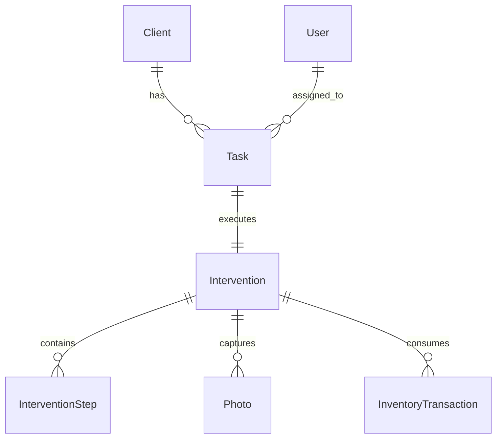

# DOMAIN MODEL: CORE ENTITIES & RULES

This project follows a Domain-Driven Design (DDD) approach. The core business logic is encapsulated within entities and services in `src-tauri/src/domains/`.

## Core Entities

### 1. Task (`src-tauri/src/domains/tasks/`)
The unit of work representing a requested intervention for a vehicle.
- **Purpose**: Tracks a work request from draft/scheduling through to completion.
- **Key Fields**: `id`, `task_number`, `vehicle_plate`, `status`, `priority`, `technician_id`, `client_id`, `scheduled_date`, `ppf_zones`.
- **Status Enum**: `Draft`, `Scheduled`, `InProgress`, `Completed`, `Cancelled`, `OnHold`, `Pending`, `Invalid`, `Archived`, `Failed`, `Overdue`, `Assigned`, `Paused`.
- **Relations**:
  - Belongs to a **Client**.
  - Assigned to a **User** (Technician).
  - Has one **Intervention** (once started).

### 2. Intervention (`src-tauri/src/domains/interventions/`)
The active execution phase of a task.
- **Purpose**: Orchestrates the real-time workflow (steps, photos, measurements).
- **Key Fields**: `id`, `task_id`, `status`, `current_step`, `completion_percentage`, `vehicle_vin`, `started_at`, `completed_at`, `quality_score`.
- **Status Enum**: `Pending`, `InProgress`, `Paused`, `Completed`, `Cancelled`, `Archived`.
- **Relations**:
  - Belongs to a **Task** (1:1).
  - Has many **InterventionSteps**.

### 3. InterventionStep (`src-tauri/src/domains/interventions/`)
A discrete phase within an intervention (e.g., "Front Bumper Inspection").
- **Purpose**: Enforces specific quality checkpoints and photo requirements.
- **Key Fields**: `id`, `intervention_id`, `step_number`, `step_name`, `step_type`, `step_status`, `requires_photos`, `photo_count`.
- **Step Types**: `Inspection`, `Preparation`, `Installation`, `Finalization`.
- **Step Statuses**: `Pending`, `InProgress`, `Paused`, `Completed`, `Failed`, `Skipped`, `Rework`.

### 4. Client (`src-tauri/src/domains/clients/`)
The customer entity (Individual or Business).
- **Purpose**: Stores contact details, address, and aggregate statistics.
- **Key Fields**: `id`, `name`, `email`, `phone`, `customer_type`, `address_street`, `tax_id`.

### 5. Inventory/Material (`src-tauri/src/domains/inventory/`)
Tracks physical materials used during interventions.
- **Entities**: `Material`, `InventoryTransaction`.
- **Purpose**: Monitors consumption of film rolls and kits.

## Domain Relationships Map

## Storage Facts
- **Table Names**: `tasks`, `interventions`, `intervention_steps`, `clients`, `users`, `materials`.
- **Soft Delete**: Entities use a `deleted_at` (i64 timestamp) column to indicate deletion without purging data.
- **Audit Fields**: Every entity includes `created_at`, `updated_at`, `created_by`, and `updated_by`.
- **ID Strategy**: All primary keys are **UUID strings** (v4).

## Domain Rules (Critical Constraints)
1. **Validation**:
   - `vehicle_plate` and `scheduled_date` are mandatory for any task.
   - `InterventionStep` completion may require a minimum number of photos (`min_photos_required`).
2. **Lifecycle Transitions**:
   - A Task cannot move to `InProgress` until an Intervention is created.
   - An Intervention cannot be `Completed` until all mandatory steps are finished.
3. **Offline Integrity**:
   - Data is flagged with `synced: boolean`.
   - Local changes are recorded in the `sync_queue` table (TODO: verify exact table name).
