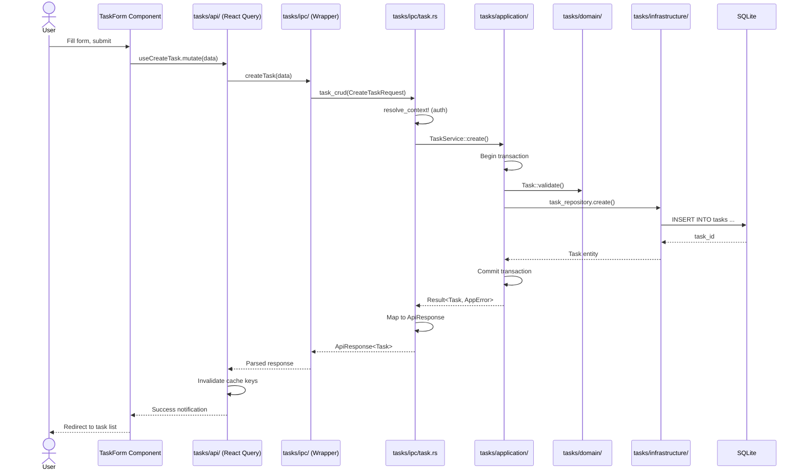
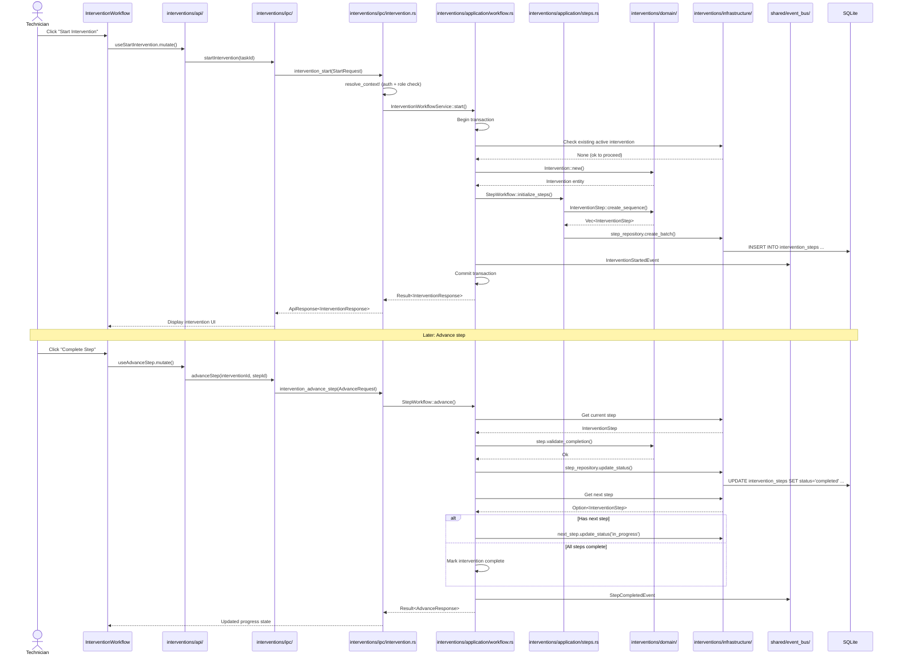
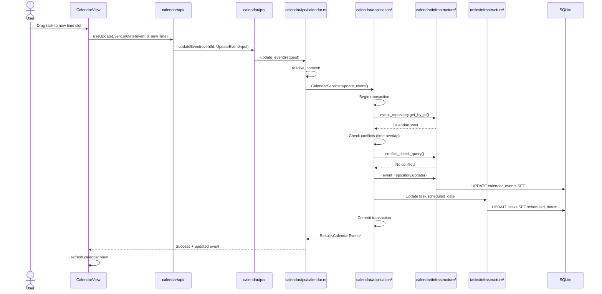

# RPMA v2 - Architecture and Data Flows

> Layered architecture, data flow patterns, and offline-first implementation details.

---

## Layered Architecture

The system follows **Domain-Driven Design (DDD)** with strict layer boundaries:

```
┌─────────────────────────────────────────────────────────────────┐
│                     FRONTEND (Next.js 14)                       │
│  ┌─────────────┐  ┌─────────────┐  ┌─────────────────────────┐  │
│  │   Routes    │  │ Components  │  │  State Management       │  │
│  │  (app/)     │  │(shadcn/ui)  │  │  - TanStack Query       │  │
│  └──────┬──────┘  └─────────────┘  │  - Zustand              │  │
│         │                           │  - React Hook Form      │  │
│         │                           └─────────────────────────┘  │
│         │                                                       │
│  ┌──────┴──────────────────────────────────────────────────┐   │
│  │              DOMAIN IPC WRAPPERS                         │   │
│  │         (frontend/src/domains/*/ipc/*.ts)                │   │
│  └───────────────────────┬──────────────────────────────────┘   │
└──────────────────────────┼──────────────────────────────────────┘
                           │ IPC (Tauri invoke)
┌──────────────────────────┼──────────────────────────────────────┐
│                     BACKEND (Rust/Tauri)                        │
│                         │                                       │
│  ┌──────────────────────┴──────────────────────────────────┐   │
│  │  IPC LAYER (src-tauri/src/domains/*/ipc/)               │   │
│  │  • Command handlers                                     │   │
│  │  • Request context resolution                           │   │
│  │  • Auth/validation entry checks                         │   │
│  └──────────────────────┬──────────────────────────────────┘   │
│                         │                                       │
│  ┌──────────────────────┴──────────────────────────────────┐   │
│  │  APPLICATION LAYER (src-tauri/src/domains/*/application/)│   │
│  │  • Use case orchestration                               │   │
│  │  • Transaction boundaries                               │   │
│  │  • Fine-grained authorization                           │   │
│  │  • NO raw SQL here!                                     │   │
│  └──────────────────────┬──────────────────────────────────┘   │
│                         │                                       │
│  ┌──────────────────────┴──────────────────────────────────┐   │
│  │  DOMAIN LAYER (src-tauri/src/domains/*/domain/)         │   │
│  │  • Pure business logic                                  │   │
│  │  • Entities, value objects                              │   │
│  │  • Validation rules                                     │   │
│  │  • Domain events                                        │   │
│  │  • NO I/O operations!                                   │   │
│  └──────────────────────┬──────────────────────────────────┘   │
│                         │                                       │
│  ┌──────────────────────┴──────────────────────────────────┐   │
│  │  INFRASTRUCTURE LAYER (src-tauri/src/domains/*/infrastructure/)│
│  │  • Repositories (raw SQL)                               │   │
│  │  • External adapters                                    │   │
│  │  • DB persistence                                       │   │
│  └──────────────────────┬──────────────────────────────────┘   │
│                         │                                       │
│  ┌──────────────────────┴──────────────────────────────────┐   │
│  │  DATABASE (SQLite WAL mode)                             │   │
│  │  • Local system of record                               │   │
│  │  • Embedded migrations                                  │   │
│  │  • Pool: r2d2_sqlite                                    │   │
│  └──────────────────────────────────────────────────────────┘   │
└─────────────────────────────────────────────────────────────────┘
```

---

## Data Flow Patterns

### Pattern 1: Task Creation Flow



**Key Code Paths**:
- Frontend hook: `frontend/src/domains/tasks/api/` (TODO: verify exact path)
- IPC wrapper: `frontend/src/domains/tasks/ipc/tasks.ipc.ts`
- Handler: `src-tauri/src/domains/tasks/ipc/task.rs`
- Service: `src-tauri/src/domains/tasks/application/` (TODO: verify)
- Repository: `src-tauri/src/domains/tasks/infrastructure/` (TODO: verify)

---

### Pattern 2: Intervention Workflow Execution



**Key Code Paths**:
- Handler: `src-tauri/src/domains/interventions/ipc/intervention.rs`
- Workflow service: `src-tauri/src/domains/interventions/application/` (TODO: verify)
- Domain models: `src-tauri/src/domains/interventions/domain/models/`
- Events: `src-tauri/src/domains/interventions/domain/events/` (TODO: verify)

---

### Pattern 3: Calendar Scheduling Update



---

## Offline-First Implementation

### Core Principles

1. **Local SQLite is source of truth**
   - Path: `src-tauri/src/db/connection.rs` — Pool initialization
   - WAL mode enabled for concurrent reads/writes
   - DB location: App data directory (platform-specific)

2. **No network dependencies in critical paths**
   - Auth: Local `sessions` table (no JWT providers)
   - Data: All CRUD against local SQLite
   - Sync: Optional background queue

3. **Embedded resources**
   - Migrations: `include_dir!("migrations")` in binary
   - Type generation: Build-time export to TypeScript

### Sync Domain (When Online)

```
┌─────────────────────────────────────────────┐
│              SYNC DOMAIN                     │
│  src-tauri/src/domains/sync/                │
│                                              │
│  • SyncQueue — Buffers outgoing changes     │
│  • ConflictResolution — Last-write-wins     │
│  • SyncScheduler — Background worker        │
└─────────────────────────────────────────────┘
```

**Key Tables**:
- `sync_queue` — Pending outbound changes
- `sync_conflicts` — Conflicts requiring resolution

**Sync Flow**:
```
Local Change → SyncQueue.enqueue() → Background Worker → Remote API
                                          ↑                    ↓
                              SyncStatus updates ←────── Result
```

### Session Store

In-memory session cache for fast auth checks:

```rust
// src-tauri/src/infrastructure/auth/session_store.rs
pub struct SessionStore {
    active_session: RwLock<Option<UserSession>>,
}

impl SessionStore {
    pub fn get(&self) -> Option<UserSession> {
        // Auto-checks expiration
        // Returns None if expired
    }
}
```

---

## Event Bus (Cross-Domain Communication)

Domains communicate via in-memory event bus, not direct imports:

```rust
// src-tauri/src/shared/event_bus/mod.rs (TODO: verify)
pub struct EventBus {
    subscribers: RwLock<Vec<Box<dyn EventHandler>>>,
}

impl EventBus {
    pub fn publish(&self, event: DomainEvent) {
        // Broadcast to all subscribers
    }
    
    pub fn subscribe(&self, handler: Box<dyn EventHandler>) {
        // Register handler
    }
}
```

**Published Events** (examples):
- `InterventionStartedEvent` → Notifications domain
- `TaskAssignedEvent` → Calendar domain (for scheduling)
- `LowStockEvent` → Notifications domain (alerts)

**Code Path**: `src-tauri/src/shared/event_bus/`

---

## Request Context Flow

Every IPC command receives a `RequestContext` with auth info:

```
┌──────────────────────────────────────────┐
│  Frontend: safeInvoke(cmd, payload)      │
│  • Injects session_token automatically   │
│  • Adds correlation_id                   │
└──────────────┬───────────────────────────┘
               │
┌──────────────▼───────────────────────────┐
│  Backend: resolve_context! macro         │
│  • Validates session_token               │
│  • Extracts UserSession                  │
│  • Checks role permissions               │
│  • Returns RequestContext {              │
│      auth: AuthContext { user_id, role },│
│      correlation_id: String              │
│    }                                     │
└──────────────┬───────────────────────────┘
               │
┌──────────────▼───────────────────────────┐
│  Application Service receives context    │
│  • Uses ctx.auth.user_id for audit       │
│  • Uses ctx.auth.role for authorization  │
└──────────────────────────────────────────┘
```

**Code Paths**:
- Frontend: `frontend/src/lib/ipc/utils.ts` — `safeInvoke()`
- Backend macro: `src-tauri/src/shared/auth_middleware.rs` — `resolve_context!`

---

## Database Transaction Boundaries

Application layer manages transactions:

```rust
// Pattern: src-tauri/src/domains/<domain>/application/
pub struct TaskService {
    db: Arc<Database>,
    task_repo: TaskRepository,
}

impl TaskService {
    pub async fn create_task(&self, ctx: &RequestContext, req: CreateTaskRequest) 
        -> Result<Task, AppError> 
    {
        let tx = self.db.begin_transaction().await?;
        
        // 1. Validate domain rules
        Task::validate_create(&req)?;
        
        // 2. Create entity
        let task = Task::new(req);
        
        // 3. Persist
        self.task_repo.create(&tx, &task).await?;
        
        // 4. Related operations (all in same tx)
        self.audit_repo.log(&tx, ctx, "task_created", &task.id).await?;
        
        // 5. Commit
        tx.commit().await?;
        
        // 6. Post-commit: publish event (outside tx)
        self.event_bus.publish(TaskCreatedEvent::new(&task));
        
        Ok(task)
    }
}
```

**Rule**: All DB operations for a use case must be in one transaction.

---

## Common Pitfalls

### 1. Layer Violations
❌ **Wrong**: Putting SQL in application layer  
✅ **Right**: Application layer calls Repository

❌ **Wrong**: IPC handler with business logic  
✅ **Right**: IPC handler delegates to Application Service

### 2. Cross-Domain Imports
❌ **Wrong**: `use crate::domains::clients::infrastructure::ClientRepo;` in tasks domain  
✅ **Right**: Use event bus or shared interfaces in `src-tauri/src/shared/`

### 3. Transaction Boundaries
❌ **Wrong**: Multiple transactions for one use case  
✅ **Right**: Single transaction wrapping all operations

### 4. Sync/Code Drift
❌ **Wrong**: Manually editing `frontend/src/types/`  
✅ **Right**: Run `npm run types:sync` after Rust model changes

---

## Next Steps

- **Frontend Patterns**: See [03_FRONTEND_GUIDE.md](./03_FRONTEND_GUIDE.md)
- **Backend Implementation**: See [04_BACKEND_GUIDE.md](./04_BACKEND_GUIDE.md)
- **IPC Commands**: See [05_IPC_API_AND_CONTRACTS.md](./05_IPC_API_AND_CONTRACTS.md)

---

*Architecture enforced by: scripts/architecture-check.js, scripts/anti-spaghetti-guards.js*
