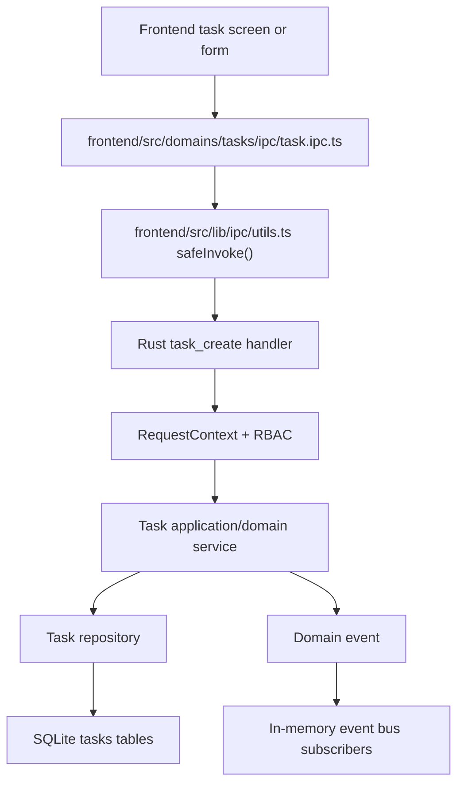
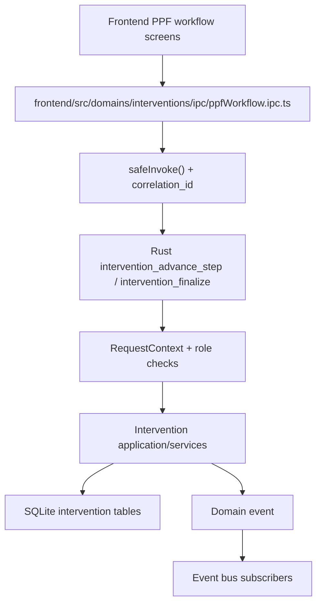
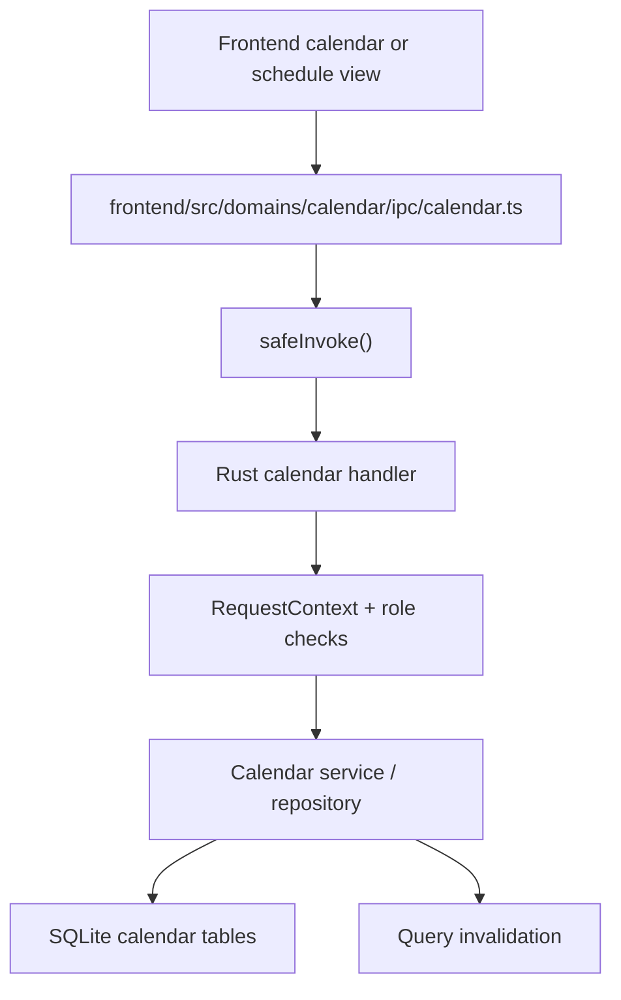

# 02. ARCHITECTURE AND DATAFLOWS

RPMA v2 uses a thin IPC boundary and keeps business logic in Rust, with local SQLite as the source of truth.

`Next.js UI -> typed IPC wrapper -> Tauri command -> Rust application/domain/infrastructure -> SQLite`

## Layer Map

| Layer | Main paths | Rule |
|---|---|---|
| Frontend | `frontend/src/app/*`, `frontend/src/domains/*`, `frontend/src/lib/ipc/*` | Use typed wrappers, not raw `invoke()` |
| IPC | `src-tauri/src/domains/*/ipc/*`, `src-tauri/src/commands/*` | Thin handlers only |
| Application / Domain | `src-tauri/src/domains/*/application/*`, `src-tauri/src/domains/*/domain/*` | Business rules and invariants live here |
| Infrastructure | `src-tauri/src/domains/*/infrastructure/*`, `src-tauri/src/db/*` | SQLite, repositories, adapters |

## Runtime Wiring

- `src-tauri/src/main.rs` initializes the app, opens the DB, applies migrations, and registers commands.
- `src-tauri/src/service_builder.rs` builds shared services and app state.
- `src-tauri/src/shared/app_state.rs` holds long-lived services, repositories, and shared state.
- `src-tauri/src/shared/event_bus/*` provides the in-memory event bus used for cross-domain reactions.
- `src-tauri/src/shared/services/domain_event.rs` defines domain event payloads.

## Task Creation Flow

Key frontend paths:

- `frontend/src/app/tasks/*`
- `frontend/src/domains/tasks/api/*`
- `frontend/src/domains/tasks/ipc/task.ipc.ts`

Key Rust paths:

- `src-tauri/src/domains/tasks/ipc/task/facade.rs`
- `src-tauri/src/domains/tasks/domain/models/task.rs`
- `src-tauri/src/domains/tasks/domain/services/task_state_machine.rs`
- `src-tauri/src/domains/tasks/infrastructure/*`

## Intervention Step Advance / Complete

Relevant paths:

- `frontend/src/app/tasks/[id]/workflow/ppf/*`
- `frontend/src/domains/interventions/ipc/interventions.ipc.ts`
- `frontend/src/domains/interventions/ipc/ppfWorkflow.ipc.ts`
- `src-tauri/src/domains/interventions/ipc/intervention/workflow.rs`
- `src-tauri/src/domains/interventions/ipc/intervention/queries.rs`
- `src-tauri/src/domains/interventions/domain/models/*`
- `src-tauri/src/domains/interventions/infrastructure/*`

## Calendar Updates

Relevant paths:

- `frontend/src/app/page.tsx`
- `frontend/src/app/schedule/*`
- `frontend/src/domains/calendar/ipc/calendar.ts`
- `src-tauri/src/domains/calendar/calendar_handler/ipc.rs`

## Offline-First Notes

- The local SQLite database is the primary source of truth on each machine.
- `src-tauri/src/db/schema.sql` includes `sync_queue` and related legacy sync fields, but there is no clearly wired runtime sync worker in `AppStateType`.
- The current runtime uses in-memory sessions and an in-memory event bus for local coordination.
- Verify the actual runtime path in code before building features on legacy sync tables alone.

## Dependency Rules

1. Outer layers may depend on inner layers, not the other way around.
2. Domain code should not import frontend code or Tauri APIs.
3. Cross-domain work should flow through shared services, repositories, or the event bus.
4. IPC handlers should validate the request context and delegate, not host business logic.

## Where To Start

| Question | Start here |
|---|---|
| New feature end-to-end | `frontend/src/domains/<domain>/*` and `src-tauri/src/domains/<domain>/*` |
| New IPC command | `src-tauri/src/domains/<domain>/ipc/*` and `frontend/src/domains/<domain>/ipc/*` |
| DB impact | `src-tauri/src/db/schema.sql` and `src-tauri/migrations/*` |
| Cross-domain reactions | `src-tauri/src/shared/event_bus/*` |
| Shared context/auth | `src-tauri/src/shared/context/*` |

## Key Files

| File | Why it matters |
|---|---|
| `src-tauri/src/main.rs` | App startup and command registration |
| `src-tauri/src/service_builder.rs` | Service composition |
| `src-tauri/src/shared/app_state.rs` | Long-lived app state |
| `src-tauri/src/shared/context/request_context.rs` | Authenticated request context |
| `src-tauri/src/shared/event_bus/bus.rs` | In-memory event bus |
| `src-tauri/src/shared/services/domain_event.rs` | Domain event types |
| `src-tauri/src/db/migrations/mod.rs` | Startup migration application |
